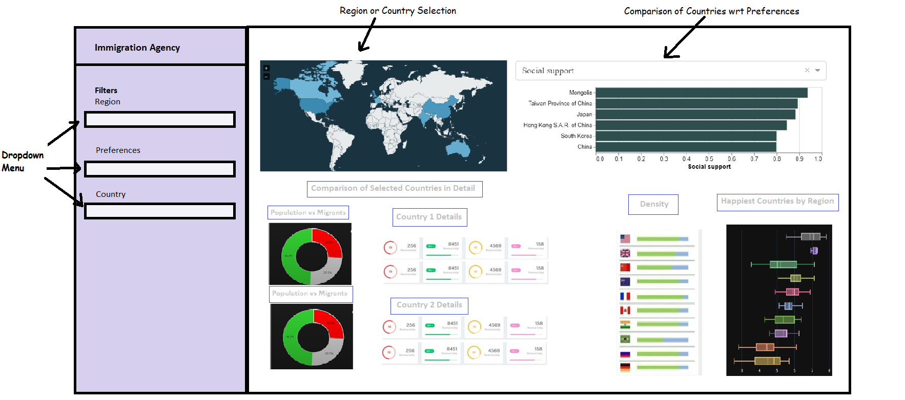

# Country Happiness Immigration Data Visualization App
Data Visualization group project

authors: Deepak Sidhu, Nicholas Wu, William Xu, Zeliha Ural Merpez

## Description of Our App

The app has a default page that presents the customized countries information via world map, bar charts, box plot and comparison widget to facilitate country specific decision-making for immigration. 

From the dropdown menu on the left side, users can first filter out one specific region (North America, Europe, Asia, Africa, etc.) they are interested in. Based on the user selection, the app will analyze and highlight the region of interest in a world map. The happiness scores calculated for the countries will be displayed in a box-plot, ranked by average. A bar chart of population density within that region will also be presented. And then in the preference filter, users can select single or multiple factors (GDP per capita, healthy life expectancy, social support, freedom to make life choices, etc.) in order to compare among countries. In an interactive bar chart, our app will compare and rank these countries with respect to the preferred metrics users selected for analysis. Based on the information, users will select two countries of interest. The app will then visualize the proportion of migrants and make in-depth comparison through pie charts and comparison widgets.

## App Sketch

